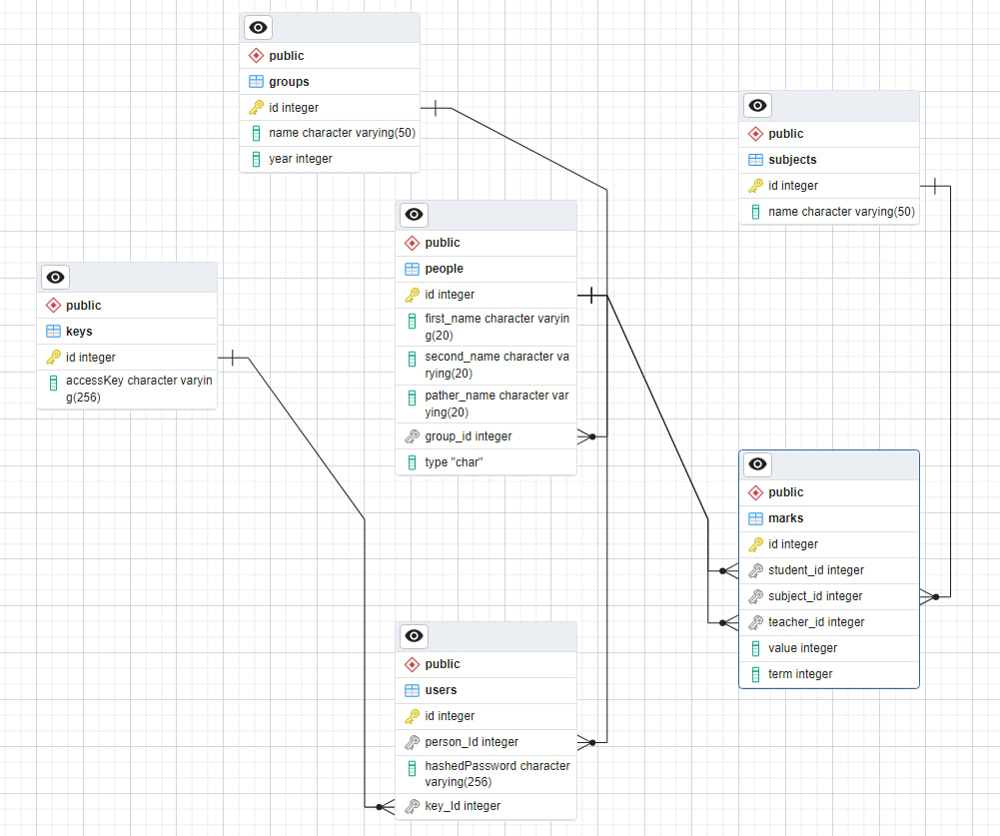

# Система управления деканатом
Это сайт для управления деканатом.

## Стек
- .NET 7 и C# 11
- EntityFramework 7
- PostgreSQL 15
- Docker
- Radzen Blazor Framework

## Cервисы
1. AccountService - сервис для управления аккаунтами и ключами верификации
2. PasswordHasher - сервис для хэширования паролей и проверки паролей на соответствие
3. GroupService - сервис для упралвения группами
4. SubjectService - сервис для управления дисциплинами и предметами
5. PersonService - сервис для упралвения студентами и преподавателями
6. MarkService - сервис для управления оценками
7. DeaneryAuthenticationStateProvider - класс предоставляет сведения о состоянии проверки подлинности текущего пользователя.

## Взаимодействие cервисов и страниц
Взаимодействие микросервисов и страниц обеспечено через SignalR: WebSocket. 

## Структура базы данных

## Функциональные требования
- Для регистрации студент указывает свой Id, который,по задумке, получает от администратора базы данных "за кулисами", а также пароль
- Для регистрации преподаватель/администратор помимо выше перечисленного ставит галочку у поля "Я - администратор" и вводит один их специальных ключей верификации, известных только преподавателям
- При входе в уже имеющийся аккаунт просто указываются Id и пароль
- Роли: студент, преподаватель/администратор системы
- Студент может смотреть оценки своей группы без возможности изменения
- Преподаватель/администратор может изменять оценки
- Преподаватель/администратор может изменять названия групп обучающихся, а также редактировать год их поступления. Есть возможность добавления новых.
- Преподаватель/администратор может смотреть аналитику и графики успеваемости учащихся по опеределенным предметам или среди выбранных групп
- Преподаватель/администратор может редактировать записи из базы данных, касающиеся учеников или преподавателей. Есть возможность добавления новых.
- Преподаватель/администратор может изменять названия предметов обучения. Есть возможность добавления новых.я

## Данный проект несет несколько целей:
* Научиться/закреить умения работы с системой контроля версий
* Подтянуть знания по api postgresql
* Улучшить навыки работы с ASP.NET в общем и Blazor в частности
* Познакомиться с библиотекой компонентов Radzen

## Запуск
* Клонируйте репозиторий
* Скачайте пакет psycopg2: __pip install psycopg2__ или __pip install psycopg2-binary__
* Перейдите в директорию DeaneryManagementSystem/DeaneryManagementSystem/
* Введите команду __docker-compose build__, затем
  __docker-compose up -d__
* Перейдите в директорию ./Database
* Запустите скрипт build.py: __python .\db_initialize.py__ , не обращайте внимания на предупреждения
* Всё готово: введите в браузере **localhost:8888** (либо другой порт, если решите поменять его в файле docker-compose.yml, в блоке blazorserver)  

## Выполнил студент
Ярослав Боков, 5130904/10101
